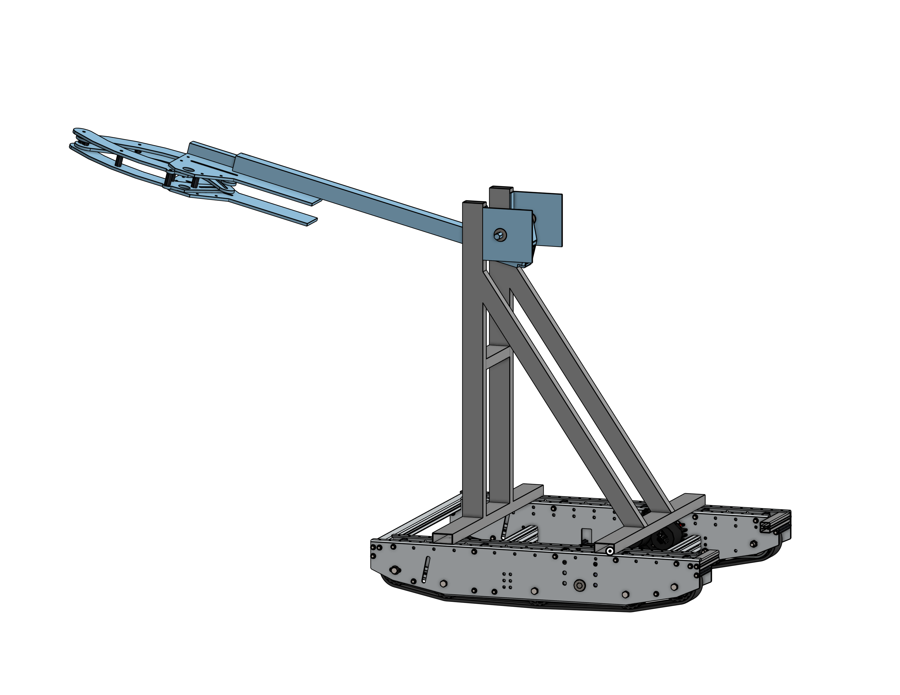

# Printer 5 (FRC 2023)

Source code for the Iron Tiger's 2023 robot *Printer 5*.

- [Printer 5 (FRC 2023)](#printer-5-frc-2023)
  - [2023 Game - CHARGED UP℠](#2023-game---charged-up)
    - [Game Overview](#game-overview)
  - [Features](#features)
    - [Robot](#robot)
    - [Software](#software)
      - [Autonomous](#autonomous)
      - [Teleoperated](#teleoperated)
  - [Tech Stack](#tech-stack)
  - [License](#license)

## 2023 Game - CHARGED UP℠

### Game Overview

In CHARGED UP℠ presented by Haas, two competing alliances are invited to process game pieces to bring energy to their community. Each alliance brings energy to their community by retrieving their game pieces from substations and scoring it into the grid. Human players provide the game pieces to the robots from the substations. In the final moments of each match, alliance robots race to dock or engage with their charge station!

Each match begins with a 15-second autonomous period, during which time alliance robots operate only on pre-programmed instructions to score points by:

- leaving their community,
- retrieving and scoring game pieces onto the grid,
- docking on or engaging with their charge station.

In the final 2 minutes and 15 seconds of the match, drivers take control of the robots and score points by:

- continuing to retrieve and score their game pieces onto the grid and
- docking on or engaging with their charge station.

The alliance with the highest score at the end of the match wins!

## Features

### Robot

- Tank tread drivetrain for maximum traction on the charge station
- Rotating/extending arm with pneumatic for double substation cone pick-up and high/mid node placement
- Motorized intake for floor pickup and hybrid node placement of cubes

### Software

#### Autonomous

- Highly configurable and consistent
- Place cone high
- Leave community ending near game pieces from end nodes
- Leave community, return to charge station, and balance from middle nodes

#### Teleoperated

- Unique control scheme
  - Two Logitech Attack 3 Joysticks
  - One joystick to control forward velocity
  - One joystick to conrol rotaional velocity
- Easy control of robot mechanisms per driver specifications
- Angled camera for clear view of floor intake

## Tech Stack

- [WPILib](https://github.com/wpilibsuite/allwpilib/tree/v2023.4.2)
- [TigerLib](https://github.com/itrt4176/tigerlib/tree/v2023.1.0)
- [SysId](https://docs.wpilib.org/en/stable/docs/software/pathplanning/system-identification/index.html)
- [PathPlanner](https://github.com/mjansen4857/pathplanner/tree/v2023.4.1)
- [FRC Web Components](https://github.com/frc-web-components/frc-web-components)

## License

© 2023 Iron Tigers Robotics Team (FRC #4176)

[GPLv3](LICENSE.md)

[WPILib License](WPILib-License.md)
